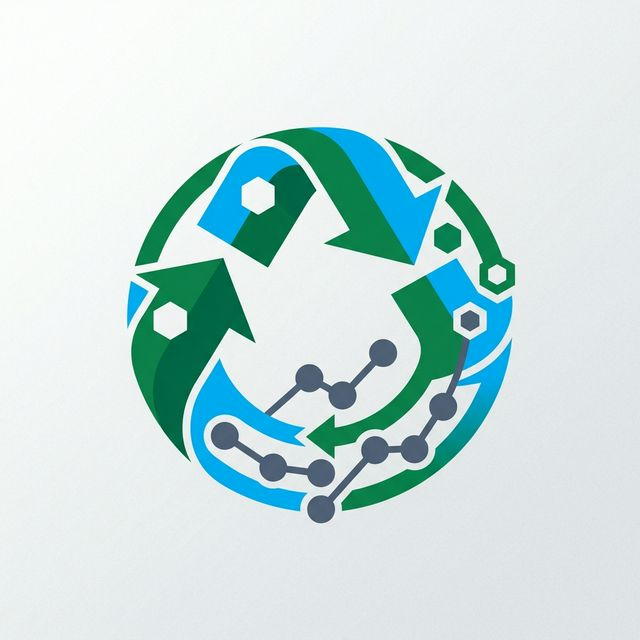
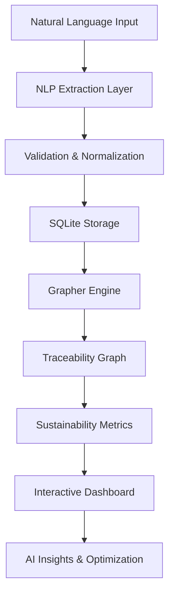

<p align="center">
  
</p>

# ♻️ RecycleIT: Intelligent Traceability for a Circular Economy


**RecycleIT** is an end-to-end intelligent traceability platform designed to solve the critical visibility gaps in the plastic recycling industry. By combining **Conversational AI**, **Graph-based Analytics**, and **Sustainability Metrics**, RecycleIT transforms fragmented data into actionable intelligence, ensuring every gram of plastic is accounted for throughout its journey from waste to new product.

---

## 🚀 Key Features

### 💬 Conversational Data Ingestion
Bridging the gap between manual entry and digital records. Users can record complex material transactions using natural language (e.g., *"Received 500 kg of PET bottles from Delhi Vendor yesterday"*). Our NLP pipeline (Phi-3-mini/Llama 3.2 via Ollama) extracts structured JSON, validates it, and updates the traceability graph in real-time.

### 🗺️ Dynamic Traceability Mapping
Visualizing the entire material lifecycle using a high-fidelity graph engine. RecycleIT identifies every transformation, segregation, and processing stage, providing a "digital passport" for batches of recycled material.

### 📊 Sustainability Intelligence
Go beyond simple tracking. RecycleIT calculates the real-world environmental impact of your operations using research-backed LCA factors:
- **Carbon Offset**: Total kg of CO₂ emissions avoided vs. virgin production.
- **Water Saved**: Liters of freshwater conserved.
- **Energy Recovery**: kWh of electricity recovered through thermal processing.
- **Landfill Diversion**: Accurate percentage of material successfully reclaimed.

### 🧠 AI-Driven Insights & Anomaly Detection
RecycleIT's intelligent core automatically identifies "loss hotspots" and anomalies in the recycling chain. If a washing stage produces 15% loss when the benchmark is 5%, RecycleIT alerts you instantly and suggests optimizations.

---

## 🛠️ Technology Stack

| Layer | Technologies |
| :--- | :--- |
| **Frontend** | [Next.js 15](https://nextjs.org/), [React 19](https://react.dev/), [Tailwind CSS](https://tailwindcss.com/) |
| **Backend** | [Python 3.13](https://www.python.org/), [Flask](https://flask.palletsprojects.com/) |
| **Graph Intelligence** | [NetworkX](https://networkx.org/), [KùzuDB](https://kuzudb.com/) |
| **AI/ML** | [Phi-3-mini](https://ollama.com/library/phi3), [Ollama](https://ollama.com/), [Gemini Flash API](https://ai.google.dev/) |
| **Data Visualization** | [D3.js](https://d3js.org/), [Recharts](https://recharts.org/), [React Flow](https://reactflow.dev/) |
| **Database** | [SQLite](https://www.sqlite.org/) |

---

## 🏗️ Project Architecture



### Multi-Modal Data Ingestion
1. **Conversational**: Primary method via chat interface.
2. **Batch Upload**: CSV/Excel support for legacy data.
3. **Rest API**: Programmatic integration for existing enterprise systems.

---

## 📂 Directory Structure

```plaintext
d:\Hackniche
├── backend/            # Python/Flask service, NLP agents, & Grapher engine
├── frontend/           # Next.js dashboard and conversational UI
├── scanner-app/        # Mobile-ready interface for material scanning
├── scripts/            # Utility scripts for data generation & setup
├── qr_codes/           # Generated traceability QR codes
├── PLAN.md             # Detailed implementation roadmap
└── SUSTAINABILITY_METRICS.md # Research-backed calculation framework
```

---

## ⚡ Quick Start

### 1. Prerequisites
- Python 3.13+
- Node.js 20+
- [Ollama](https://ollama.com/) installed and running

### 2. Backend Setup
```bash
cd backend
python -m venv .venv
source .venv/bin/activate  # Or .venv\Scripts\activate on Windows
pip install . 
# Alternatively, if you have uv:
uv sync
python app.py
```

### 3. Frontend Setup
```bash
cd frontend
npm install
npm run dev
```

### 4. AI Setup (Local LLM)
```bash
ollama pull phi3:mini
```

---

## 🌍 Sustainability Calculation Framework

Our metrics are derived from the [Global Recycling Coalition](https://www.globalrecycling.org/) and [EPA](https://www.epa.gov/waste) standards. For every kg of PET plastic recycled, RecycleIT accounts for:
- **3.2 kg CO₂ saved** (Avoided petroleum extraction & polymerization)
- **24 L of water saved**
- **0.85 kWh of energy recovery potential**

For full details on our LCA methodology, see [SUSTAINABILITY_METRICS.md](./SUSTAINABILITY_METRICS.md).

---

© 2026 RecycleIT | Built for a Greener Future.
